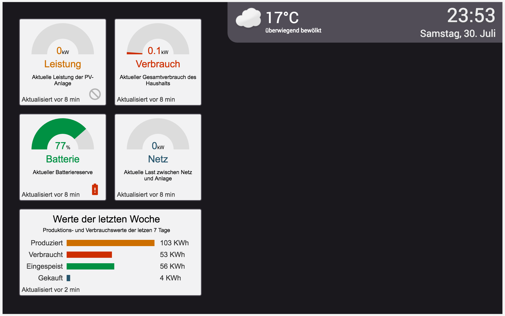

# SolarBoard: A Dashboard for SolarEdge(TM) Systems

# Overview
SolarBoard is a javascript dashboard for [SolarEdge](http://www.solaredge.com/) systems.  It visualizes production, consumption and storage of PV-systems. The dashboard shows an aggregated overview for the current system state and historical data from the last week.

# Build

* Replace placeholders in `config.json` and rename file to `_config.json`
* Run `npm install`
* Run `grunt srv` to build the server application
* Run `grunt www` to build the client application

# Usage

After both targets are build switch to `build` and run `npm start`. The client can be reached via `http://localhost:PORT`. The port can be specified in the config file.

# Usage (deployed)

Run 'node run.js` in the project directory
